# Pengembangan Website Rute Angkot

 

## KATA PENGANTAR

Segala puji dan syukur kami panjatkan kepada Tuhan Yang Maha Esa atas limpahan rahmat dan karunia-Nya sehingga buku ini dapat diselesaikan dengan baik. Salawat serta salam semoga selalu tercurah kepada Nabi Besar Muhammad SAW. 

Kami ingin mengucapkan terima kasih yang sebesar-besarnya kepada semua pihak yang telah memberikan dukungan dan bantuan dalam penulisan buku ini, mulai dari orang tua, dosen pembimbing, rekan-rekan, hingga semua pihak yang tidak dapat kami sebutkan satu per satu. 

Buku ini, yang berjudul "Pengembangan Website Rute Angkot", dibuat dengan harapan dapat memberikan panduan praktis bagi pembaca dalam mengembangkan aplikasi atau sistem terkait. Kami berusaha sebaik mungkin untuk menyajikan isi buku ini dengan lengkap dan mudah dipahami. 

Kami menyadari bahwa buku ini masih jauh dari sempurna. Oleh karena itu, kritik dan saran yang membangun dari para pembaca sangat kami harapkan untuk perbaikan di masa mendatang. 

Semoga buku ini dapat bermanfaat dan menambah wawasan bagi para pembaca dalam bidang pengembangan website, serta memberikan kontribusi positif bagi masyarakat. Terima kasih. 

## PRAKATA

Di era digital yang terus berkembang pesat, teknologi telah menyentuh berbagai aspek kehidupan, termasuk transportasi. Angkutan kota (angkot) memiliki peran vital dalam kehidupan masyarakat perkotaan, dan kini informasi rute angkot dapat diakses dengan mudah melalui internet.

Website rute angkot adalah salah satu teknologi yang semakin diminati, karena memudahkan pengguna untuk mengakses informasi mengenai rute, jadwal, dan detail lainnya dengan cara yang terstruktur dan mudah diakses. Pembuatan website yang menampilkan tabel rute angkot menjadi sangat penting, karena memungkinkan pengguna memperoleh informasi dengan cepat dan tepat.

Buku ini bertujuan untuk memberikan panduan yang komprehensif tentang cara merancang dan membangun website yang menampilkan tabel rute angkot. Setiap chapter dalam buku ini disusun dengan langkah-langkah yang mudah diikuti, khususnya bagi pembaca yang baru memulai.

Kami berharap buku ini dapat memberikan kontribusi positif dalam meningkatkan keterampilan pengembangan website para pembaca. Terima kasih telah memilih buku ini sebagai panduan belajar Anda.

Selamat belajar dan semoga sukses!

## DAFTAR ISI

### CHAPTER 1 PERSIAPAN LINGKUNGAN PENGEMBANG

#### 1.1 INSTALILASI GOLANG

#### 1.2 SETTING UP VISUAL STUDIO CODE DAN EKSTENSI YANG DIPERLUKAN

### CHAPTER 2 MEMBANGUN BACKEND DENGAN GOLANG

#### 2.1 STRUKTUR DASAR PROYEK GOLANG

#### 2.2 IMPORT PACKAGE

### CHAPTER 3 MEMBANGUN DATABASE (MONGODB)

#### 3.1 MENGHUBUNGKAN DATABASE (MONGODB)

### CHAPTER 4 MEMBANGUN FRONTEND DENGAN JAVASCRIPT

#### 4.1 STRUKTUR DASAR PROYEK JAVASCRIPT

#### 4.2 INTEGRASI HTML DAN CSS

### CHAPTER 5 MEMBUAT API RUTE ANGKOT

#### 5.1 MERANCANG RESTFUL API DENGAN GOLANG

#### 5.2 CRUD OPERATION UNTUK DATA RUTE ANGKOT

#### 5.3 TESTING API MENGGUNAKAN POSTMAN

### CHAPTER 6 INTEGRASI FRONTEND DAN BACKEND

#### 6.1 MENGHUBUNGKAN FRONTEND DENGAN API BACKEND

### CHAPTER 7 MENAMPILKAN UI WEBSITE YANG SUDAH DIBUAT

#### 7.1 TAMPILAN USER

#### 7.2 TAMPILAN ADMIN

### DAFTAR PUSTAKA

### TENTANG PENULIS

## CHAPTER 1 PERSIAPAN LINGKUNGAN PENGEMBANG

### 1.1 INSTALILASI GOLANG

Go, juga dikenal sebagai Golang, adalah bahasa pemrograman yang dikembangkan oleh Google untuk membantu Anda menulis kode secara efisien dan mudah, aman, terukur, dan mudah dipelihara. Go dirancang untuk menyederhanakan manajemen ketergantungan dan proses pengembangan perangkat lunak. Bahasa ini secara asli mendukung konkurensi dan konkurensi, menjadikannya pilihan populer untuk pengembangan perangkat lunak yang memerlukan kinerja dan skalabilitas tinggi.(Blumen & Meyerson, n.d.) 

Berikut adalah cara singkat untuk menginstal Golang di berbagai sistem operasi:

#### Instalasi di Windows

1.  Unduh Installer: Kunjungi situs resmi Golang dan unduh file installer .msi.
2.  Jalankan Installer: Jalankan file installer dan ikuti petunjuknya.
3.  Set PATH: Tambahkan C:\Go\bin ke variabel lingkungan PATH.
4.  Verifikasi: Buka Command Prompt dan ketik go version.  

##### Instalasi di macOS

1.  Unduh Installer: Kunjungi situs resmi Golang dan unduh file installer .pkg.
2.  Jalankan Installer: Buka file .pkg dan ikuti petunjuknya.
3.  Set PATH: Tambahkan export PATH=$PATH:/usr/local/go/bin ke file profil shell Anda (misalnya, ~/.zshrc).
4.  Verifikasi: Buka Terminal dan ketik go version.  

###### Instalasi di Linux

1. Unduh dan Ekstrak: Kunjungi situs resmi Golang dan unduh file .tar.gz. Ekstrak ke /usr/local.
   [GambarInstalasiLinux](<Images/Screenshot (460).png>) 
2. Set PATH: Tambahkan export PATH=$PATH:/usr/local/go/bin ke file profil shell Anda (misalnya, ~/.bashrc).
3. Verifikasi: Buka Terminal dan ketik go version.
   Dengan mengikuti langkah-langkah di atas, Anda akan siap untuk mulai menggunakan Golang di sistem operasi Anda.  

### 1.2 SETTING UP VISUAL STUDIO CODE DAN EKSTENSI YANG DIPERLUKAN

Visual Studio Code adalah editor kode sumber terbuka oleh Microsoft. Visual Studio Code mendukung berbagai bahasa pemrograman dan dikenal untuk fitur seperti debugging dan penyelesaian kode. Biasanya digunakan untuk pengembangan web dan berbasis cloud, berkat fleksibilitas dan perpustakaan ekstensinya. Editor menawarkan kontrol, manajemen build, pengujian unit, dan kemampuan pengujian statis. Dengan fitur-fitur ini, menjadikannya alat yang berharga bagi pengembang.(Murari & Sandru, 2013) 

Dalam pengembangan website ini, hanya diperlukan tiga ekstensi penting yang akan menyederhanakan proses dan meningkatkan efisiensi. 

1. Eksntensi Golang

Karena dalam pengembangan ini kita akan menggunakan bahasa pemrograman Go, tentu saja ekstensi ini sangat diperlukan untuk mendukung dan menyempurnakan proses coding kita. 
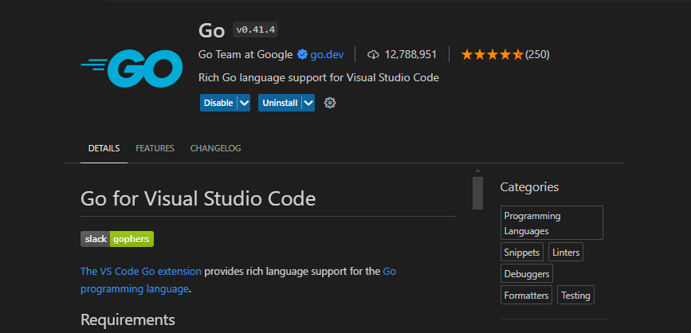 

2. Ekstensi JavaScript

Ekstensi ini sangat penting untuk membantu penulisan sintaks-sintaks JavaScript dengan lebih mudah dan efisien, sehingga mempercepat proses pengembangan dan meningkatkan kualitas kode. 
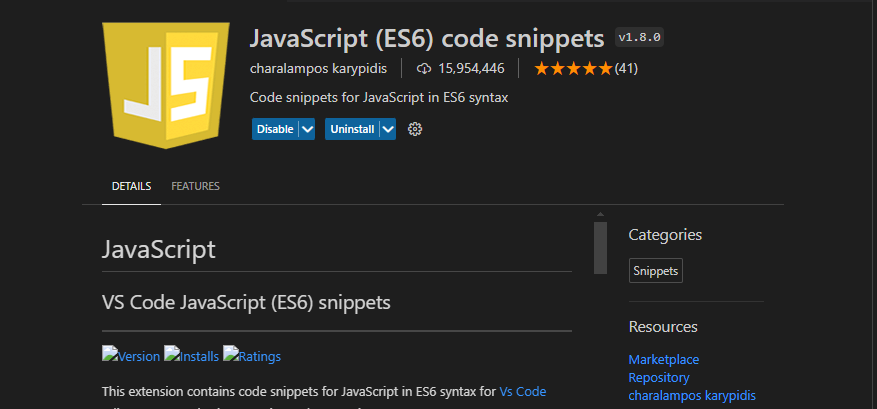

3. Ekstensi Prettier

Terakhir, ekstensi yang paling wajib diinstall adalah ini. Dengan ekstensi ini, kita dapat dengan mudah mengatasi penulisan kode yang berantakan, karena ekstensi ini akan merapikan kode secara cepat dan otomatis, sehingga meningkatkan efisiensi dan kualitas kerja kita. 
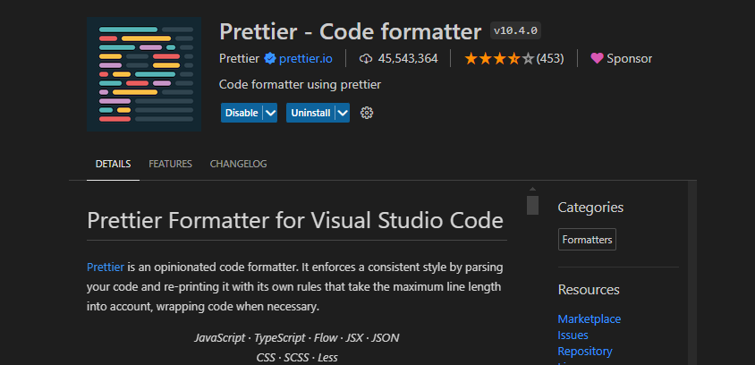 

Sebenarnya, ekstensi-ekstensi dapat disesuaikan sesuai kebutuhan spesifik, namun sebagai dasar, ketiga ekstensi ini sangat diperlukan untuk memulai dan mempermudah pengembangan suatu website.

## CHAPTER 2 MEMBANGUN BACKEND DENGAN GOLANG

“Backend” mewakili elemen sisi server dalam kerangka web yang berfungsi sebagai mediator antara klien dan repositori data, seperti database, cache Redis, atau penyimpanan blob. Ini bertanggung jawab untuk mengelola logika operasional, manipulasi data, dan komunikasi dengan database atau aset tambahan yang penting untuk mendukung aplikasi berbasis web.(Morozov, 2020) 

### 2.1 STRUKTUR DASAR PROYEK GOLANG

[GambarStrukturProjekGolang](<Images/Screenshot (459).png>) 
Integrasi dalam konteks proyek Go melibatkan banyak aspek, mulai dari menghubungkan berbagai bagian proyek, mengelola dependensi dengan cerdas, hingga memastikan aplikasi berjalan lancar. Dalam panduan ini, kita akan melihat bagaimana setiap komponen proyek saling berinteraksi secara harmonis. Yuk, kita jelajahi cara terbaik untuk mengintegrasikan semua ini ke dalam proyek Go kita!

#### 2.1.1 Konfigurasi Proyek (config/)

Ini adalah file kunci yang digunakan untuk mengatur aplikasi atau sistem. Di dalamnya terdapat berbagai pengaturan penting seperti konfigurasi database, pengaturan lingkungan, koneksi ke layanan eksternal, dan banyak lagi yang diperlukan agar sistem berjalan dengan lancar dan sesuai kebutuhan. File ini memainkan peran vital dalam memastikan bahwa aplikasi atau sistem dapat beroperasi dengan efisien dan dapat diadaptasi sesuai dengan perubahan lingkungan atau kebutuhan pengguna.
Isi: Konfigurasi seperti file "config.yml" atau "config.json" Cara penggunaan: Anda akan memuat konfigurasi ini ke dalam file kontroler atau file "Main.go", seperti yang ditunjukkan dalam gambar berikut:
[Carbon 3.1](Images/config.png)  

#### 2.1.2 Controller (controller/)

Controller adalah komponen MVC yang berfungsi sebagai perantara antara model dan tampilan. Melalui antarmuka pengguna (UI), controller menerima input pengguna, memprosesnya, dan kemudian mengirimkan output kembali ke pengguna dalam bentuk tampilan atau data yang diminta.
Isi: Fungsi yang menangani permintaan HTTP Cara penggunaan: Fungsi kontroler akan dipanggil melalui rute di "route/". Contohnya:
[Carbon 3.2](Images/controller.png)  

#### 2.1.3 Helper (helper/)

Helper biasanya berisi fungsi kecil yang sering digunakan di berbagai bagian aplikasi, seperti fungsi untuk format tanggal, mengelola string, dan fungsi utilitas lainnya.Isi: Fungsi utilitas yang dapat digunakan di tempat lain.Cara Penggunaan: Import fungsi helper ke controller atau file lain. Contohnya:
[Carbon 3.3](Images/helper.png)  

#### 2.1.4 Model (model/)

Mengelola data dan logika bisnis aplikasi adalah bagian dari MVC. Model menunjukkan struktur data aplikasi dan memberi tahu cara berinteraksi dengan database dan sumber data lainnya. Isi: Model atau struktur data yang terkait dengan database. Cara Penggunaan: Untuk berinteraksi dengan database, gunakan model ini di controller. Contohnya:
[Carbon 3.4](Images/model.png)  

#### 2.1.5 Rute (route/)

Rute, yang biasanya didefinisikan dalam file khusus, menentukan URL dan metode HTTP (GET, POST, dll.) serta tindakan yang harus dilakukan saat permintaan HTTP diterima. Isi: Mendefinisikan endpoint HTTP. Cara Penggunaan: Mendefinisikan endpoint dengan menggunakan router, seperti mux. Contohnya:
[Carbon 3.5](Images/route.png)  

#### 2.1.6 Main (main.go/)

File main biasanya merupakan entri utama aplikasi. Aplikasi dimulai di sini dan konfigurasi awal dimulai. Setelah itu, mereka beralih ke komponen lain seperti rute, pengontrol, atau model.
Titik masuk utama aplikasi adalah isi. Cara Penggunaan: Ini adalah tempat Anda memulai konfigurasi, router, dan server HTTP. Contohnya:
[Carbon 3.6](Images/main.png)  

### 2.2 IMPORT PACKAGE

Untuk menggunakan MongoDB dalam codingan, langkah pertama yang perlu dilakukan adalah menambahkan paket MongoDB ke proyek Anda. Di awal setiap file Go, menentukan paket yang akan digunakan adalah hal yang penting. Paket-paket ini seperti kotak alat yang membantu mengorganisir dan mengelompokkan kode Anda, sehingga memudahkan penggunaan kembali dan pengelolaan kode secara efisien. Dengan demikian, Anda dapat fokus pada pengembangan fitur dan fungsionalitas tanpa perlu membangun semuanya dari awal.
Untuk contoh program:  

#### context

Untuk mengatur batas waktu, pembatalan, dan berbagi nilai antar goroutine, paket konteks menyediakan tipe dan fungsi. Dalam contoh ini, context.TODO() digunakan untuk membuat konteks kosong, yang menunjukkan bahwa Anda belum menentukan konteks sebenarnya. Seringkali digunakan sebagai penutup sementara.  

#### fmt

Paket standar Go yang dikenal sebagai fmt memiliki fungsi untuk memformat dan mencetak teks ke konsol atau output lainnya. Dalam kasus ini, fmt.Println digunakan untuk mencetak pesan ke konsol, yang menunjukkan ketika koneksi ke MongoDB berhasil atau ketika dokumen telah disisipkan ke dalam koleksi.  

#### log

Paket log menawarkan fasilitas logging sederhana. Misalnya, log.Fatal digunakan untuk mencetak pesan kesalahan ke konsol dan menghentikan program jika terjadi kesalahan selama proses koneksi atau operasi MongoDB. Ini membantu menangani dan melacak kesalahan dalam aplikasi.  

#### time

Paket waktu memiliki tipe dan fungsi untuk mengatur waktu dan durasi. Namun, dalam kasus ini, paket waktu tidak digunakan secara langsung. Namun, dalam aplikasi nyata, paket ini sering diperlukan untuk mengatur waktu koneksi atau menunggu selesainya operasi tertentu.  

#### go.mongodb.org/mongo-driver/mongo

Paket mongo termasuk dalam driver MongoDB resmi untuk Go dan menyediakan tipe dan fungsi yang diperlukan untuk berinteraksi dengan MongoDB. Misalnya, mongo.Connect digunakan untuk menghubungkan ke server MongoDB, dan mongo.Collection digunakan untuk berinteraksi dengan koleksi tertentu yang ada dalam database.  

#### go.mongodb.org/mongo-driver/mongo/options

Paket opsi adalah komponen driver MongoDB resmi untuk Go yang memberi klien, basis data, dan koleksi MongoDB berbagai opsi konfigurasi. Dalam kasus ini, options.Client().Untuk menghubungkan MongoDB ke URI, ApplyURI digunakan.  

#### go.mongodb.org/mongo-driver/bson

Paket bson menawarkan tipe dan fungsi untuk bekerja dengan BSON (Binary JSON), format data yang digunakan MongoDB untuk menyimpan dokumen. Dalam kasus ini, bson.D digunakan untuk membuat dokumen BSON yang akan disisipkan atau diambil dari MongoDB.

Dengan mengimpor paket-paket ini, Anda mendapatkan semua alat yang dibutuhkan untuk terhubung dan berinteraksi dengan MongoDB menggunakan Go. Ini tidak hanya mempermudah proses pengembangan, tetapi juga memberikan fitur-fitur khusus yang berguna dalam berbagai aspek pembuatan aplikasi. Mulai dari penanganan kesalahan dengan lebih efisien hingga kemampuan mencetak data langsung ke konsol, paket-paket ini seperti teman setia yang membantu Anda mengeksplorasi dan memanfaatkan potensi penuh MongoDB dalam proyek Anda.  

## CHAPTER 3 MEMBANGUN DATABASE (MONGODB)

MongoDB adalah basis data NoSQL berbasis dokumen yang dikembangkan oleh MongoDB Inc. dan bersifat open-source. Basis data ini menggunakan format objek JavaScript (JSON) untuk menyimpan dan mengambil data, yang kemudian dikonversi ke format BSON saat disimpan. Keunggulan MongoDB termasuk skalabilitas yang mudah, performa tinggi, dan kemampuan untuk menangani data yang besar.

### 3.1 MENGHUBUNGKAN DATABASE

Berikut adalah contoh dokumen MongoDB:
.png>)  

.png>)  

Langkah pertama, buka browser favorit kamu dan cari "MongoDB" di kolom pencarian. Setelah itu, kamu akan diarahkan ke halaman web yang mirip dengan gambar di bawah ini
.png>) 
Kamu bisa langsung klik tombol "Try Atlas Free" dan langsung diarahkan ke halaman seperti yang ada di gambar di bawah ini.
.png>) 
Setelah berhasil login atau sign up, langkah selanjutnya adalah menuju halaman web yang menampilkan informasi seperti yang terlihat dalam gambar di bawah ini.
.png>) 

Silakan isi formulir berikut sesuai kebutuhan kamu, seperti kebutuhan organisasi atau proyek. Setelah selesai mengisi formulir, klik tombol "Finish". Sebelum membuat cluster, pastikan untuk mengunduh MongoDB Compass terlebih dahulu agar cluster bisa digunakan dengan baik.

Tambahkan halaman web baru dan cari "MongoDB Compass" di kolom pencarian browser kamu. Setelah itu, kamu akan langsung diarahkan ke halaman web yang menampilkan tampilan seperti gambar di bawah ini.
.png>) 

Lalu kalian bisa click button “Download Now” dan kalian akan di arahkan ke halaman web Donwloadnya.
.png>) 

Seperti yang terlihat pada gambar di atas, silakan unduh MongoDB Compass (GUI) dan tunggu beberapa saat untuk menyelesaikan proses unduhan. Pengguna macOS dapat mengubah platformnya untuk menyesuaikan dengan versi macOS mereka. Setelah unduhan selesai, kembali ke halaman awal MongoDB Atlas untuk mulai membuat cluster.
.png>) 

Masukkan username dan password kamu, lalu klik tombol "Create Database User". Setelah berhasil membuat user database, kamu akan melihat tampilan seperti yang terlihat pada gambar di bawah ini.
.png>) 

Selanjutnya, klik tombol "Choose a connection method" untuk mendapatkan Mongostring-nya.
.png>) 

Seperti gambar di atas karena kalian sudah men-download MongoDB Compass kalian bisa memilih “Access your data trhough tools Compass”.
.png>) 

Setelah memilih tools menggunakan MongoDB Compass, kamu akan diarahkan seperti yang terlihat pada gambar di atas. Pilih opsi "I have MongoDB Compass installed" karena kamu sudah mendownloadnya sebelumnya. Di bawahnya, akan muncul connection string yang akan kamu gunakan saat menggunakan software MongoDB Compass. Jangan lupa untuk menyalin connection string ini dan simpan dengan baik karena akan selalu digunakan ketika kamu mengoperasikan MongoDB Compass. Sekarang, mari menuju ke langkah terakhir.

Pertama, buka software MongoDB Compass yang sudah terinstal di komputer kamu.
.png>) 
Setelah itu, klik tombol "New Connection", tambahkan connection string yang telah kamu salin dari MongoDB Atlas sebelumnya, dan terakhir, klik tombol "Connect" untuk mulai terhubung.

.png>) 
Selamat, sekarang kamu sudah bisa menggunakan MongoDB Compass. Untuk menghubungkan ke dalam Visual Studio Code (VSC), tambahkan mongostring yang telah kamu dapatkan ke dalam codingan kamu, seperti yang terlihat dalam gambar di bawah ini.
.png>) 
Setelah menambahkan connection string, kamu bisa langsung menjalankan codingan tersebut. Jika kamu menggunakan bahasa Go, kamu dapat menjalankan file dengan perintah "go run namafile.go" di terminal kamu. Contohnya seperti yang ditunjukkan dalam gambar di bawah ini.
.png>) 
Jika saat kamu menjalankan codingan, hasilnya seperti yang terlihat pada gambar di atas, selamat! Codingan kamu sudah terhubung dengan MongoDB.

Catatan:
Untuk menambahkan database atau mengatur konfigurasinya, gunakan MongoDB Compass. Pastikan layanan web-nya tersedia di MongoDB Atlas.

### 3.2 TAHAPAN MENGHUBUNGKAN KONEKSI BASIS DATA MONGODB

Langkah 1: Melakukan instalasi Go dan MongoDB

Sebelum memulai, pastikan Anda telah menginstal Go dan MongoDB di sistem Anda. Anda dapat mengunduh dan menginstal keduanya dari situs resmi mereka.  

Langkah 2: Membuat Proyek Go

Buat folder untuk proyek baru Anda dan gunakan perintah berikut untuk memulai modul Go:
[Gambarkoneksi](<Images/tutorial koneksi (1).png>) 
setelah menjalankan perintah seperti gambar di atas kalian akan menerima hasil seperti yang ada di terminal dan sebelum ke langkah-langkah berikutnya kalian harus memasuki file tersebut dengan perintah "cd":
[Gambarkoneksi](<Images/tutorial koneksi (2).png>) 
contohnya seperti gambar di atas ini, nah setelah itu kalian harus menginstall "go.mod" untuk memulai coding menggunakan bahasa golang karena go.mod berfungsi untuk membuat import di setiap file kalian berjalan/berfungsi.
[Gambarkoneksi](<Images/tutorial koneksi (5).png>) 
setelah menjalankan perintah "go mod init nama-project kalian" kalian akan mendapatkan file "go.mod"
di direktori file kalian masing-masing
[Gambarkoneksi](<Images/tutorial koneksi (9).png>) 

Langkah 3: Menginstall MongoDB driver untuk Go
Install driver MongoDB menggunakan perintah ini:
[Gambarkoneksi](<Images/tutorial koneksi (3).png>) 
setelah menjalankan perintah seperti gambar di atas kalian akan mendapatkan hasil seperti:
[Gambarkoneksi](<Images/tutorial koneksi (6).png>) 
dan setelah selesai mengunduh MongoDB Driver nya kalian akan mendapatkan file di direktori kalian "go.sum" :
[Gambarkoneksi](<Images/tutorial koneksi (7).png>) 

Langkah 4: Membuat file main.go

## CHAPTER 4 MEMBANGUN FRONTEND DENGAN JAVASCRIPT

Frontend berfokus pada pembuatan bagian-bagian aplikasi web yang langsung berinteraksi dengan pengguna, menggunakan teknologi seperti HTML, CSS, dan JavaScript. Tujuannya adalah menciptakan antarmuka pengguna (UI) yang memberikan pengalaman pengguna (UX) yang menyenangkan, sering kali melalui penelitian, pengujian, dan perbaikan berulang untuk secara efektif memenuhi kebutuhan pengguna. Pengembangan frontend dapat dilakukan secara terpisah dari backend, memungkinkan pembuatan UI tanpa perlu sistem backend yang sepenuhnya dikembangkan.

### 4.1 STRUKTUR DASAR PROYEK JAVASCRIPT

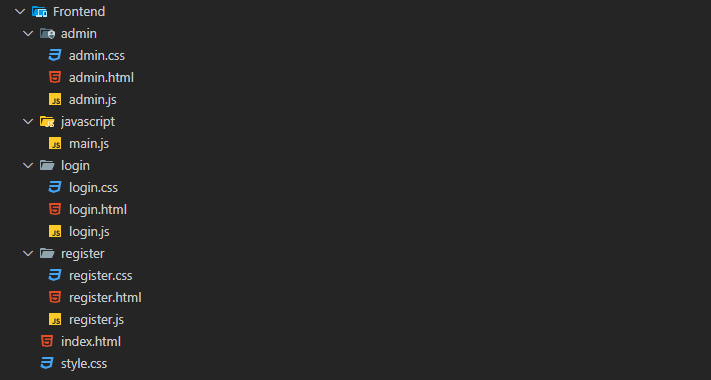  

Pada bagian Frontend, struktur direktori bisa disesuaikan sesuai keinginan. Namun, yang paling penting adalah dalam struktur ini terdapat empat file HTML: satu untuk halaman utama, satu untuk halaman admin, satu untuk halaman login, dan satu untuk halaman register. Demikian juga dengan file CSS dan JavaScript, masing-masing terdiri dari empat file yang sesuai untuk halaman utama, admin, login, dan register. 

### 4.2 INTEGRASIKAN HTML DAN CSS

#### 4.2.1 MEMBUAT FILE HTML

HTML atau HyperText Markup Language adalah format yang digunakan untuk menulis dokumen pada halaman web. Dokumen ini hampir selalu dapat diakses melalui HTTP, yaitu protokol yang menyampaikan informasi dari server situs web untuk ditampilkan kepada pengguna melalui peramban web. HTML merupakan bahasa markah yang digunakan untuk memberi tahu peramban web bagaimana menangani teks, seperti apakah teks tersebut ditulis sebagai paragraf, daftar, atau tautan, dengan menggunakan elemen-elemen yang disebut tag.

##### 1. HALAMAN UTAMA (index.html)

Kita akan memulai dengan membuat halaman utama (index.html). Halaman ini akan menampilkan tabel sederhana namun tabel tersebut akan kita panggil atau dimuat dengan menggunakan JavaScript. 

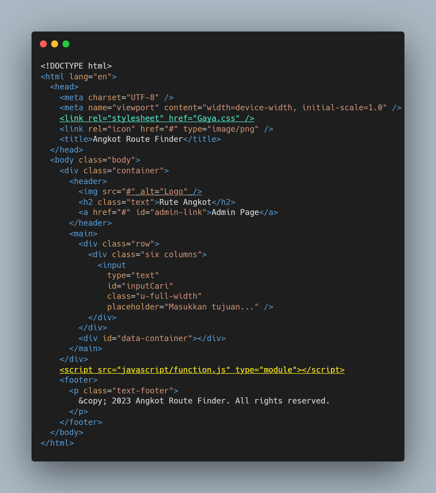  

Jangan lupa untuk memanggil link CSS dan Script JavaScript-nya. Seperti pada contoh di atas, pemanggilan CSS menggunakan teks berwarna tosca dan untuk JavaScript menggunakan teks berwarna kuning. 

##### 2. HALAMAN ADMIN (admin/admin.html)

Halaman admin akan menampilkan tabel yang berisi data tabel yang sama seperti di halaman utama dan diformat dengan gaya yang sama juga. Di sini, kita akan belajar tentang struktur HTML untuk halaman admin. Tidak seperti halaman utama, pada halaman admin kita akan menyediakan kepala tabel nya atau tag (`<th>`) dan sisanya sama seperti halaman utama di muat dengan JavaScript. Maka pada halaman admin ini membutuhkan id untuk fungsi pada JavaScrip nya nanti. 

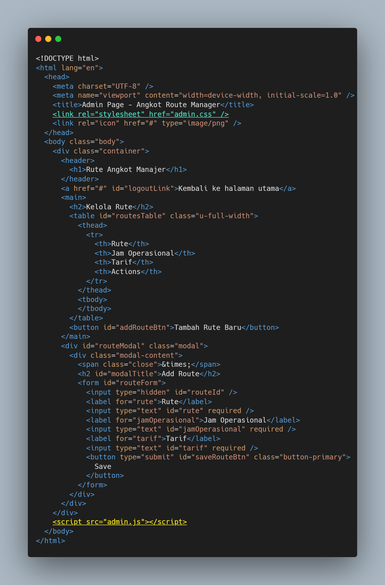  

##### 3. HALAMAN REGISTER (resgiter/register.html)

Halaman register akan memiliki form register sederhana dengan input username dan password. 

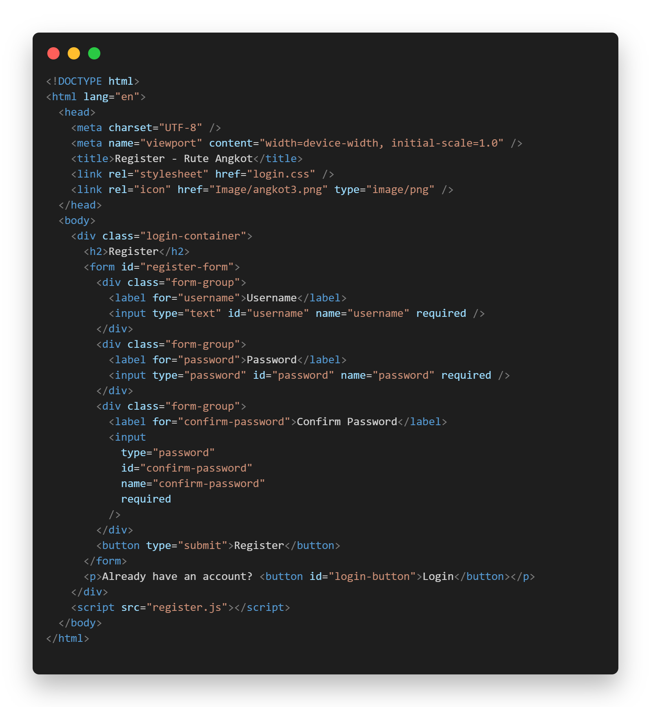 

##### 4. HALAMAN LOGIN (login/login.html)

Sama hal nya dengan halaman resgiter, pada halaman login akan memiliki form login sederhana dengan input untuk username dan password. 

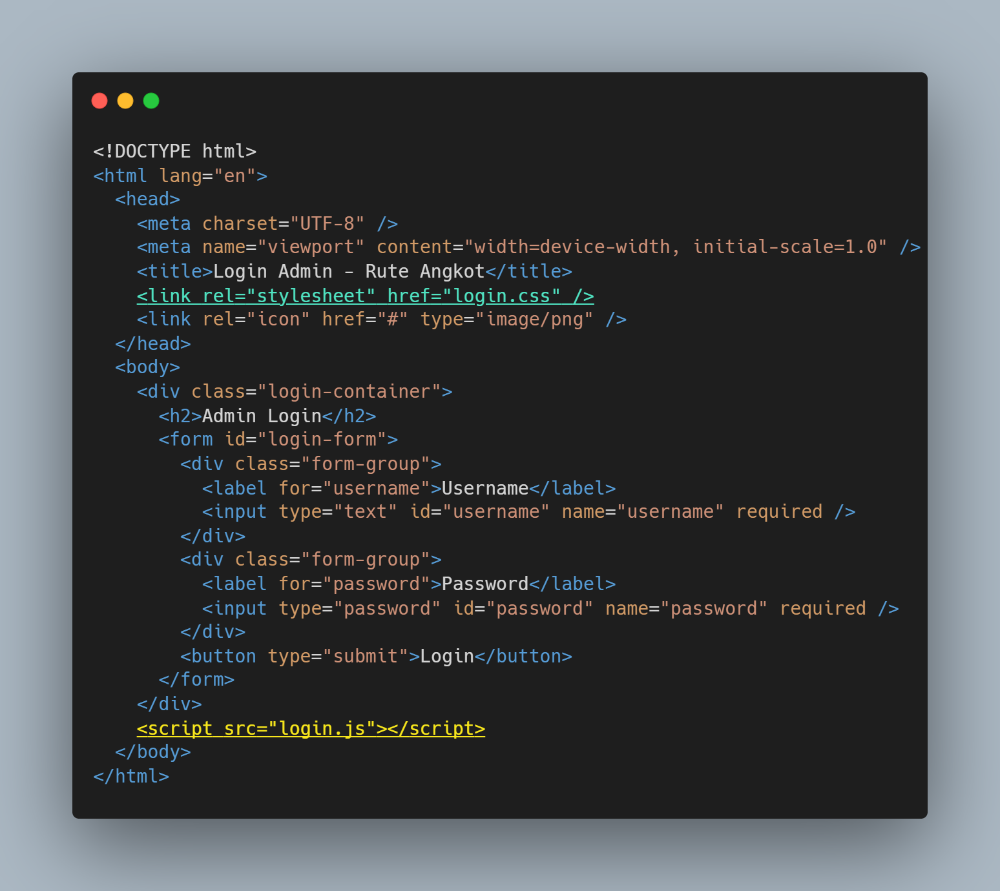  

#### 4.2.2 MENGINTEGRASIKAN CSS

CSS (Cascading Style Sheets) adalah bahasa style sheet yang digunakan untuk menentukan tampilan dan format halaman web yang ditulis dalam HTML. CSS memungkinkan pengembang web untuk memisahkan konten dari presentasi, yang membuat kode HTML lebih bersih dan lebih mudah dikelola serta memungkinkan pengembang untuk menentukan ukuran teks, font, dan warna untuk seluruh situs web tanpa perlu menyertakan informasi ini di setiap halaman, sehingga memisahkan gaya dari konten dan memudahkan proses desain.

##### 1. GAYA UMUM (style.css)

Kita akan membuat file CSS untuk halaman utama yang akan mengatur tampilan umum tabel dan elemen lain di halaman utama. Anda akan belajar tentang dasar-dasar CSS dan bagaimana menggunakannya untuk membuat halaman web terlihat lebih menarik. 
Ini kode yang mengatur elemen utama pada html. Dan yang mengatur image jika anda menambahkan gambar pada html anda. 

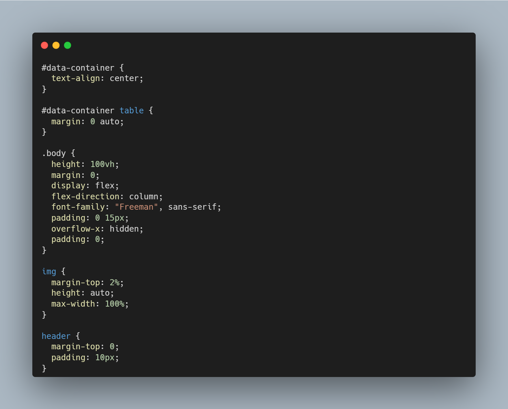  

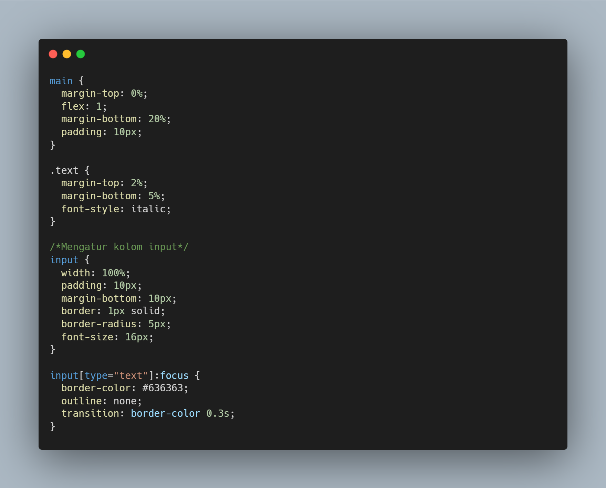  

Pada bagian ini merupakan bagian yang mengatur gaya pada tabel. 

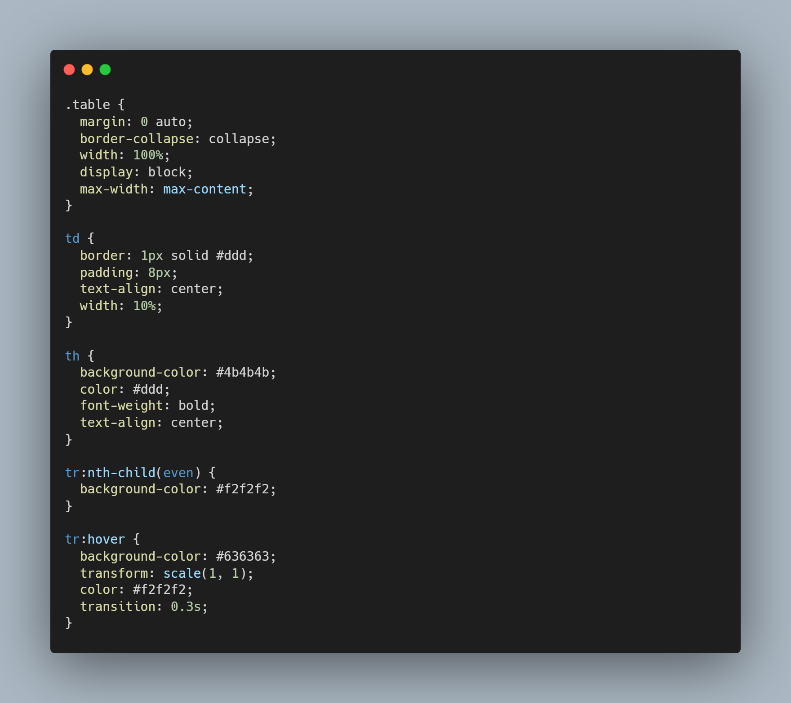  

Dan pada bagian ini untuk mengatur gaya pada footer nya. 

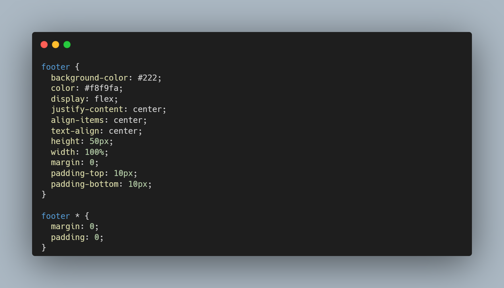 

Jangan lupa import CDN untuk framework CSS Skeleton untuk layout yang lebih rapih. Dan import font dari google, untuk font bisa disesuaikan sesuai keinginan.  

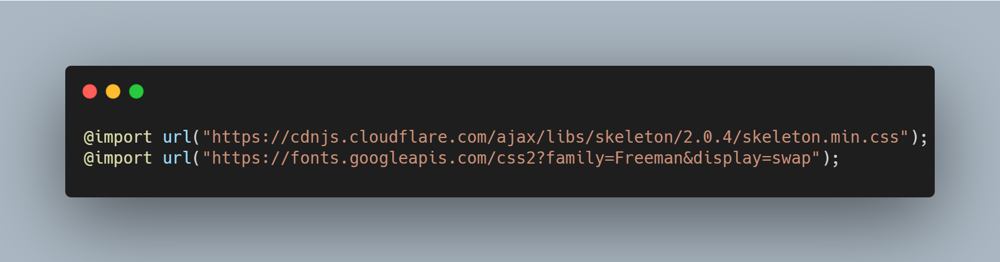 

Tambahkan juga media query agar tampilan dapat di buka pada perangkat mobile dan tetap menjaga kerapihan semua layout nya. 

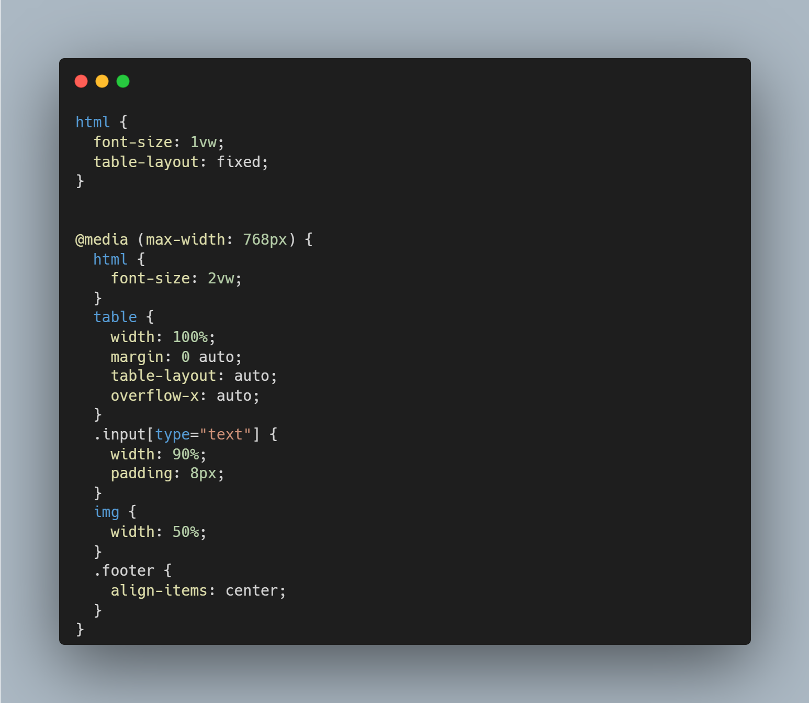  

Terakhir tambahkan juga query untuk menyesuaikan warna pada semua elemen nya jika browser menggunakan dark mode atau tidak. Ini opsional tergantung keinginan. 

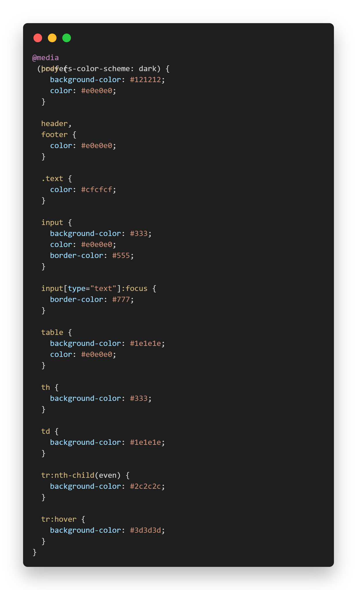  

##### 2. GAYA KHUSUS HALAMAN ADMIN (admin/admin.css)

Kita akan membuat file CSS khusus untuk halaman admin, memberikan gaya yang sedikit berbeda untuk tabel dan elemen lainnya. Ini menunjukkan bagaimana kita bisa memiliki gaya khusus untuk halaman yang berbeda dalam proyek yang sama. 

Karena banyak nya elemen pada halaman admin, ini menjadikan kode nya lebih banyak daripada CSS halaman utama. Banyak elemen yang harus di style pada halaman ini. Berikut kode nya.  

Pertama import juga font google dan CDN untuk Framework CSS Skeleton nya seperti pada CSS utama. 

Lanjut isi kode-kode ini. 

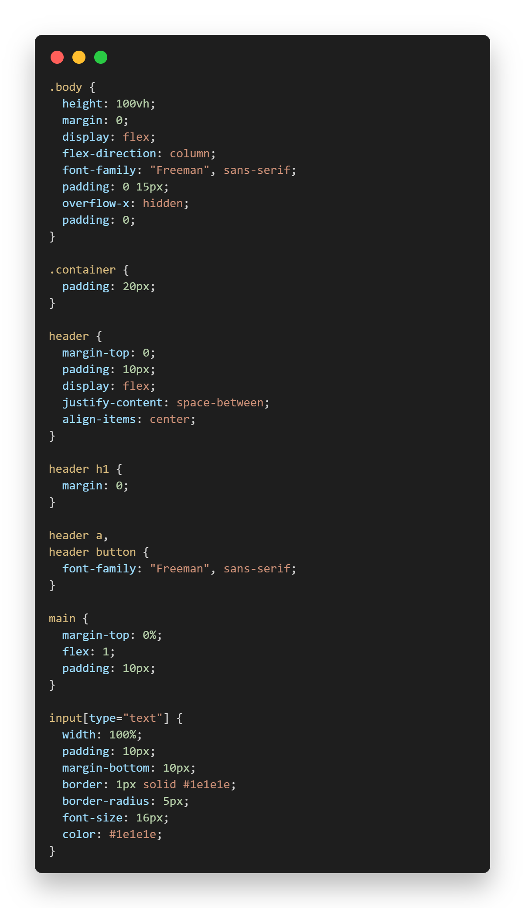 

Karena pada halaman ini memang memiliki banyak elemen, terutama elemen modal yang digunakan pada javascript nya untuk menangani suatu fungsi. Maka dari itu kita akan memberikan gaya yang sesuai untuk modal tersebut. 

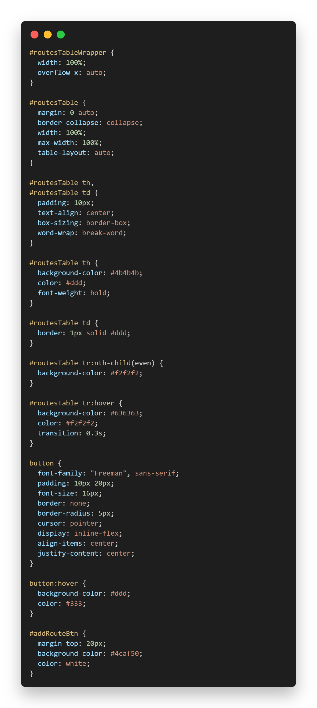 

Dan jangan lupa tambahkan juga kode untuk query responsive nya. 

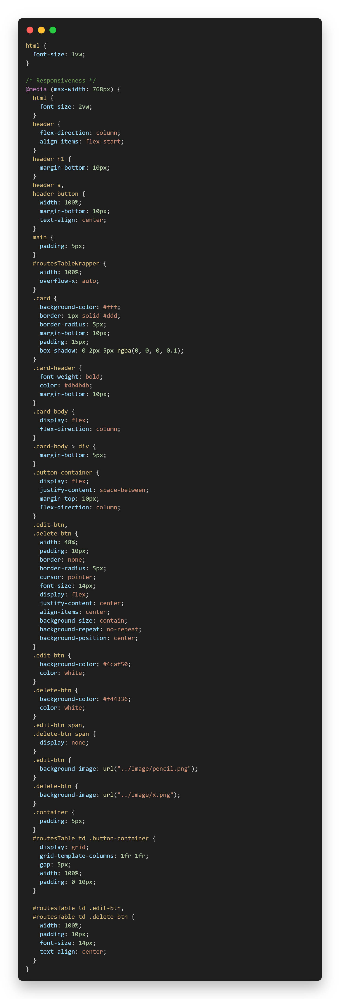 

Tamabahkan juga kode untuk query mode gelap nya seperti pada CSS utama jika memang membutuhkan. 

##### 3. GAYA KHUSUS HALAMAN REGISTER (register/register.css)

Kita akan membuat file CSS khusus untuk halaman register, memberikan gaya yang rapi dan profesional. 
Pada halaman ini tidak terlalu banyak elemen yang dibuat, maka gaya CSS nya juga tidak terlalu banyak. 

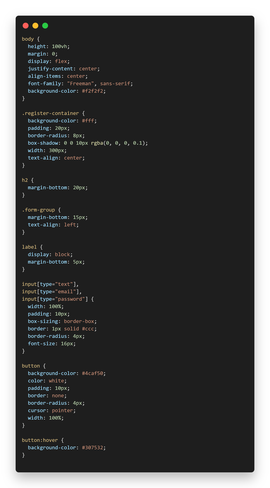

Import font google dan CDN Framework CSS Skeleton, lanjutkan buat query responsive nya. 

##### 4. GAYA KHUSUS HALAMAN LOGIN (login/login.css)

Nahh, terakhir gaya untuk file CSS halaman login. Pada file ini akan fokus pada penataan form login agar terlihat lebih rapi dan profesional sama dengan halaman register. 

Seperti pada file CSS sebelumnya import font google dan CDN Framework CSS Skeleton. 
Lanjut isi kode nya seperti ini. 

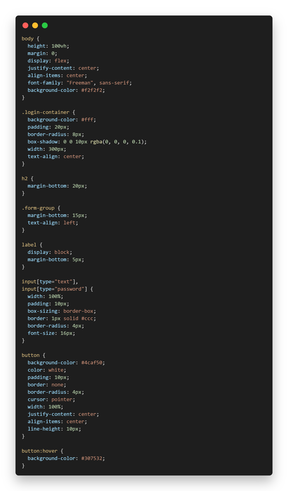 

Samal hal nya pada halaman register, pada halaman login ini tidak terlalu banyak elemen yang dibuat, maka pada pembuatan query responsive nya juga tidak terlalu banyak. 

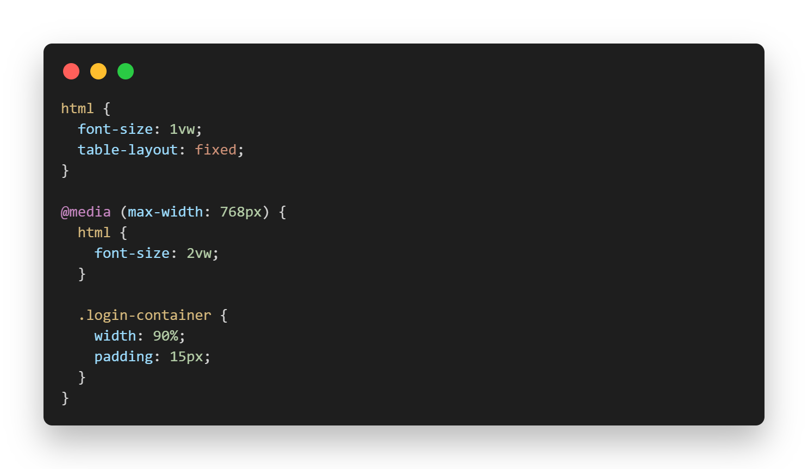 

### 4.3 INTEGRARSI JAVASCRIPT

#### MEMBUAT FILE JAVASCRIPT

JavaScript, bahasa pemrograman skrip yang banyak digunakan, memegang posisi penting dalam lanskap aplikasi web kontemporer. Bahasa ini, yang dicirikan oleh sifatnya yang dinamis, sistem pengetikan longgar, dan properti asinkron, mengambil peran penting dalam mengaktifkan fungsionalitas interaktif dalam platform berbasis web. Selain itu, JavaScript digunakan secara luas untuk memfasilitasi manipulasi real-time dan interaksi dengan Document Object Model (DOM), komponen penting dalam struktur halaman web.(Ocariza et al., 2015) 

##### 1. SKRIP UTAMA (javascript/main.js)

Kita akan membuat file JavaScript untuk halaman utama. Skrip ini akan menambahkan interaktivitas ke tabel atau elemen lainnya di halaman utama. Anda akan belajar tentang event handling dan manipulasi DOM dengan JavaScript. 

Agar data nya di muat sesuai dengan tag (`<th>`) yang pada HTML atau data nya dapat masuk ke dalam tabel, maka perlu dibuat fungsi seperti dibawah ini. 

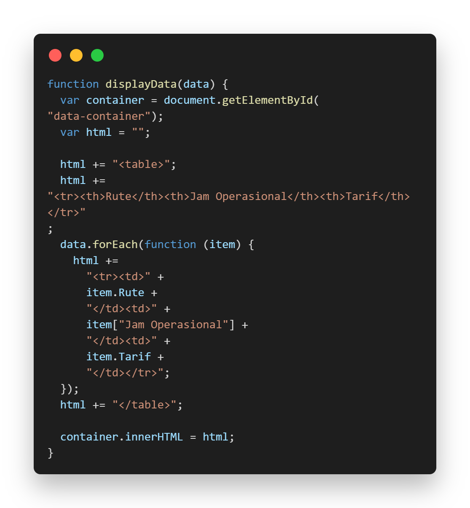 

Selanjutnya, untuk membuat kolom pencarian rute nya dapat berjalan dibutuhkan fungsi seperti ini. 

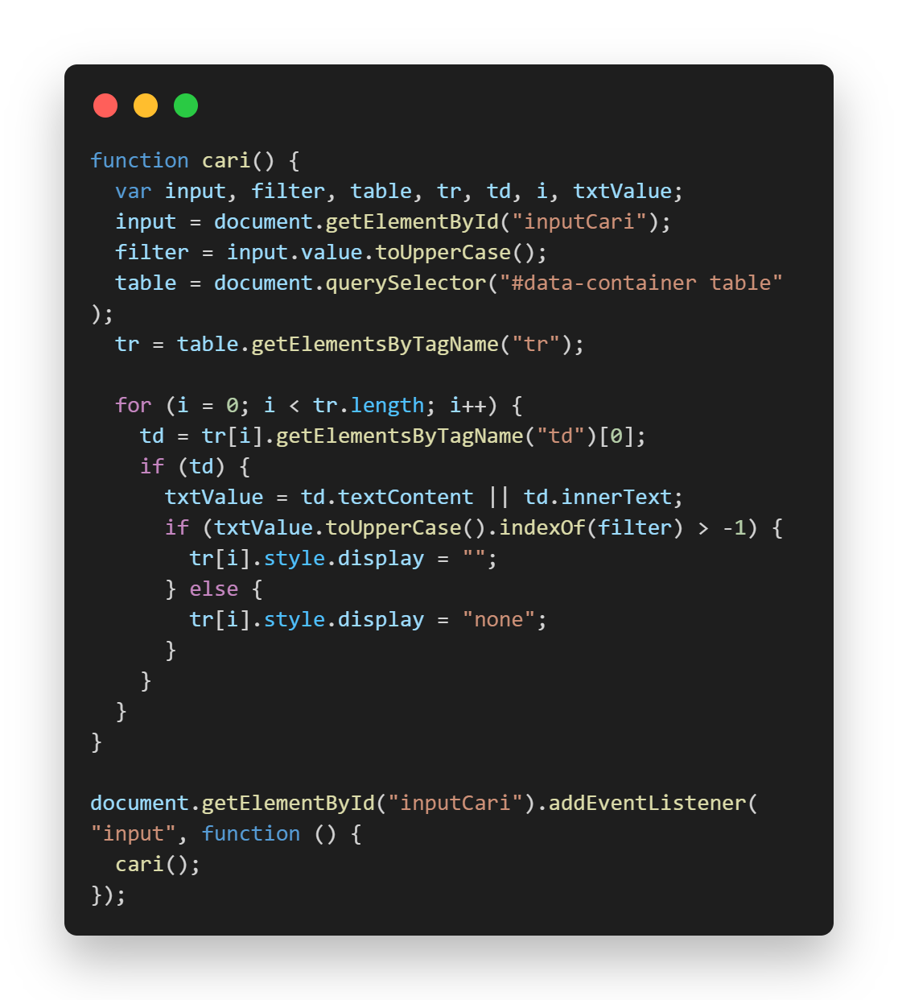 

##### 2. SKRIP ADMIN (admin/admin.js)

File JavaScript untuk halaman admin akan mengandung skrip yang dibutuhkan untuk fungsi-fungsi admin, seperti manipulasi data tabel. Ini menunjukkan bagaimana kita bisa menambahkan fungsionalitas yang berbeda di halaman admin. 

Sama seperti file javascript utama, kita akan buat fungsi agar data nya masuk ke dalam tabel, namun sedikit berbeda dengan file javascript utama. Ada penambahan elemen lain pada file javascript ini. 

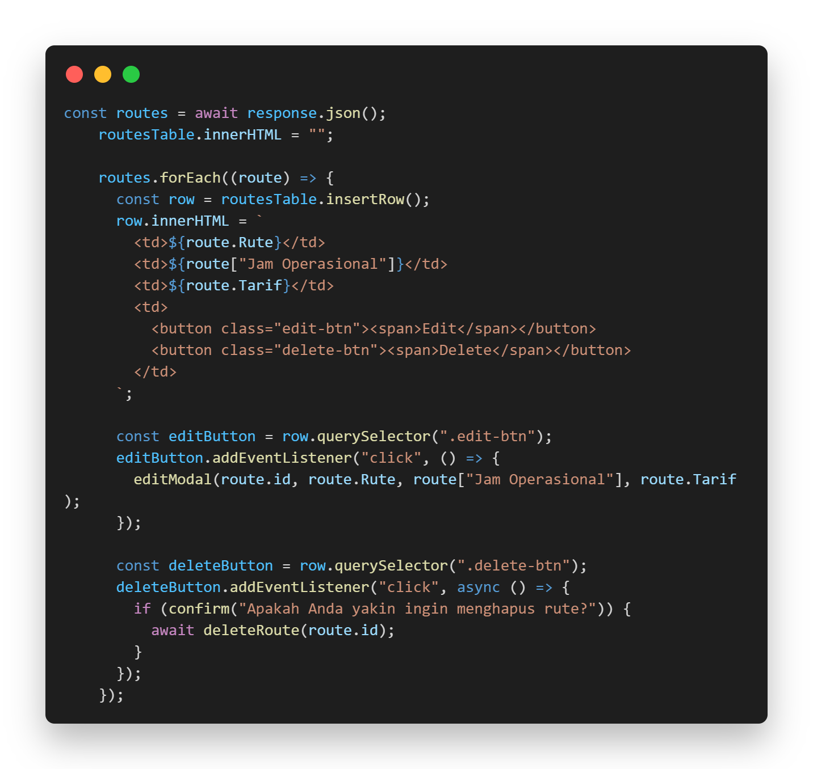 

Seperti yang sudah kita singgung pada pembahasan CSS sebelum nya mengenai modal, disinilah kita akan membuat modal tersebut. Berikut kode nya. 

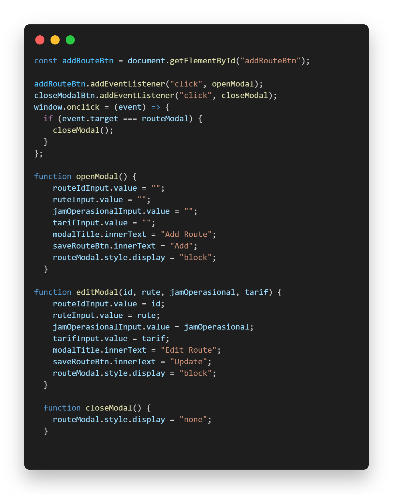 

##### 3. SKRIP REGISTER (register/register.js)

File JavaScript untuk halaman register akan mengandung skrip yang berfungsi untuk input dan menyimpan data untuk login nantinya.

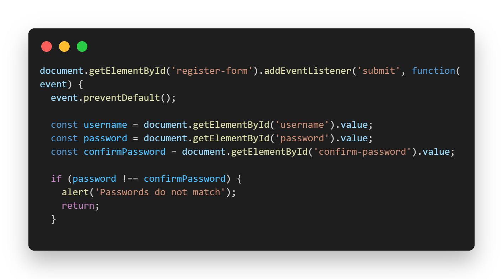 

Lanjut buat fungsi fect untuk menagkap data register dan mengirimkan nya ke database.

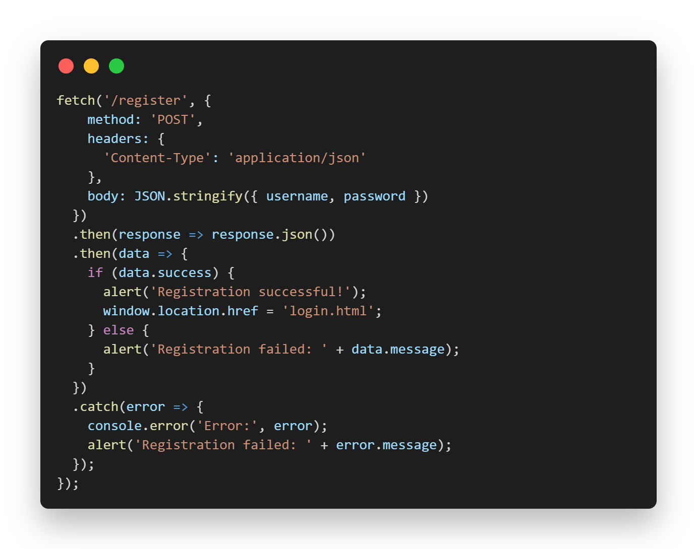 

Kemudian terakhir lakukan lagi pemanggilan id untuk button login pada halaman ini yang dimaksudkan jika mempunyai akun yang sudah terdaftar maka akan dialihkan ke halaman login. 

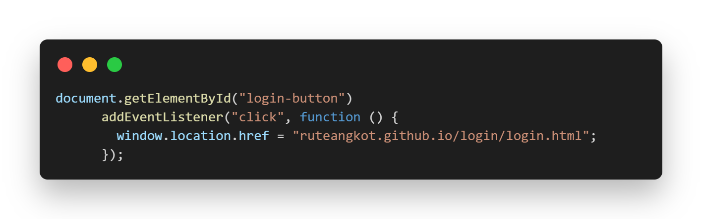

##### 3. SKRIP LOGIN (login/login.js)

Sama hal nya pada skrip register namun, File JavaScript untuk halaman login akan mengandung skrip yang berfungsi untuk validasi form atau fungsi lain yang diperlukan untuk halaman login. Ini akan membantu meningkatkan keamanan dan pengalaman pengguna di halaman login. 

Untuk file javascript login tidak terlalu banyak fungsi dan kode yang dibuat, tapi sementara buat kode nya seperti dulu. 

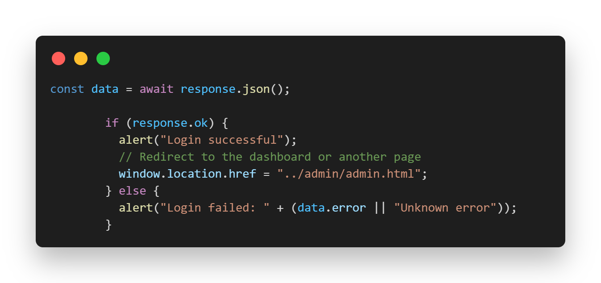 

## CHAPTER 5 MEMBUAT API UNTUK RUTE ANGKOT

### 5.1 MERANCANG RESTFUL API DENGAN GOLANG

### 5.2 CRUD OPERATION UNTUK DATA RUTE ANGKOT

### 5.3 TESTING API MENGGUNAKAN POSTMAN

Setelah API sudah dibuat maka kita akan melakukan pengetesan API tersebut memlalui Software POSTMAN, untuk melihat apakah API tersebut dapat terbaca atau tidak.

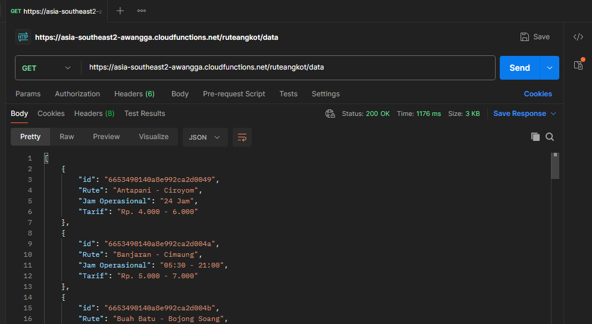 

Masukan API kemudian klik send. Lalu pilih method yang dipakai nya, jika ingin menampilkan data maka pilih method GET seperti pada gambar di atas. 

Lakukan juga untuk pengetesan untuk Create menggunakan method POST, Edit menggunakan method PUT, dan Delete menggunakan method DELETE.

## CHAPTER 6 INTEGRASI FRONTEND DAN BACKEND

### 6.1 MENGHUBUNGKAN FRONTNEND DENGAN API BACKEND

Untuk menampilkan data pada tabel maka kita perlu membuat fungsi untuk menangkap data dari API yang ada di backend. 
PI (Application Programming Interfaces) adalah alat yang memungkinkan pertukaran data antara dua sistem yang berbeda melalui antarmuka program yang sama. API web menghubungkan berbagai aplikasi ke internet, memungkinkan data dikirim dan diterima dengan mudah tanpa perlu instalasi atau kompilasi seperti perangkat lunak tradisional.

#### Pemanggilan data menggunakan XHR dan Fetch

Pada bagian ini kita akan mengambil API untuk load data halaman utama menggunakan metode XHR. 
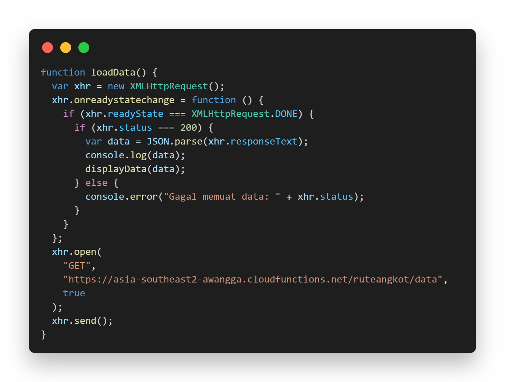 

Untuk halaman admin kita akan menggunakan metode Fetch berbeda dengan pada halaman utaman. 
 

#### Menangkap API Create

Pertama kita lakukan pengambilan API untuk fungsi Create.

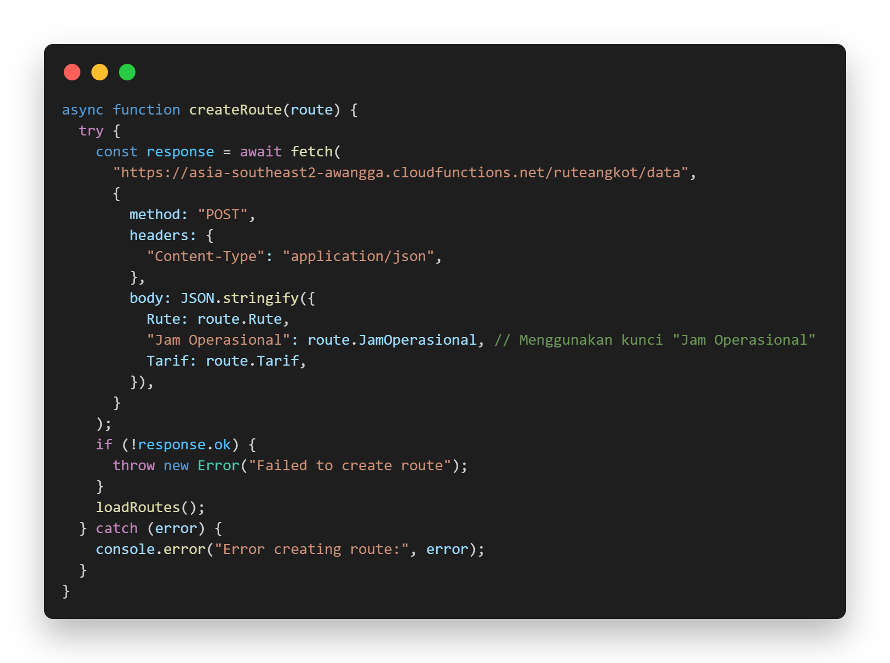 

Pada bagian akhir fungsi nya jangan lupa tambahkan variabel fungsi load data agar setiap kali habis membuat data baru, data pada tabel otomatis refresh kembali.

#### Menangkap API Update

Setelah melakukan pengambilan fungsi Create, lanjut lakukan untuk fungsi Update.

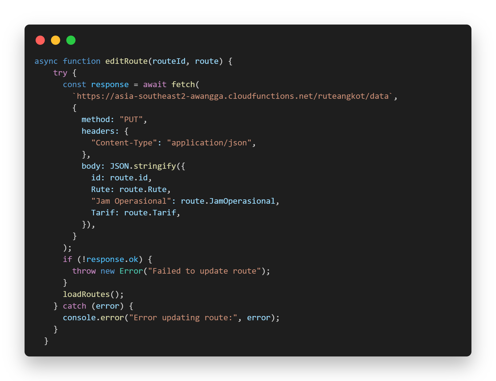

Sama seperti pada fungsi create, pada bagian akhir fungsi tambahkan variable fungsi load data, agar data tabel ter refresh kembali.

#### Menangkap API Delete

Setelah fungsi update berhasil diterapkan, terakhir lakukan juga untuk fungsi Delete nya. 

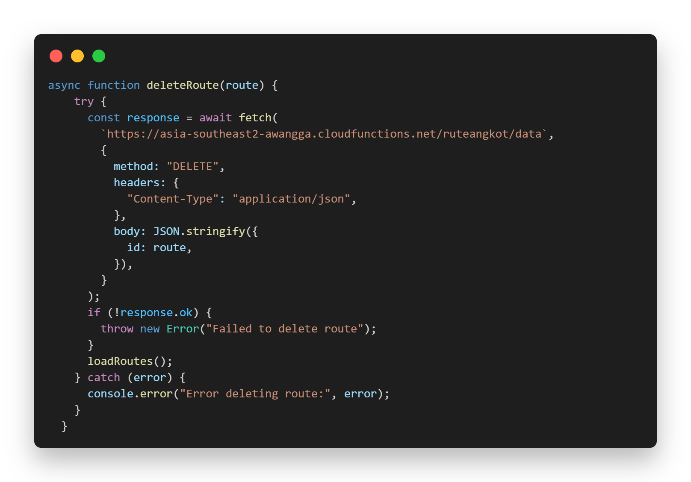

Ketiga fungsi ini yaitu, Create, update, delete, memiliki metode pemanggilan API yang sama. Akan tetapi pada bagian fungsi delete memiliki sedikit perbedaan yaitu pada bagian body function nya. Yang dipilih atau di panggil hanya field id nya saja tidak seperti pada fungsi create dan update yang memanggil semua field dari database nya.

## CHAPTER 7 TAMPILAN UI WEBSITE YANG SUDAH DIBUAT

### 7.1 TAMPILAN USER

Tampilan halaman user pada mobile. 

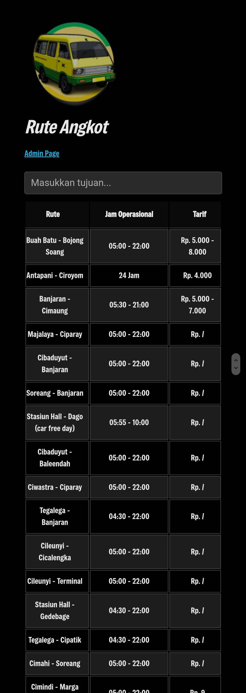 

### 7.2 TAMPILAN ADMIN

Tampilan halaman admin pada mobile. 

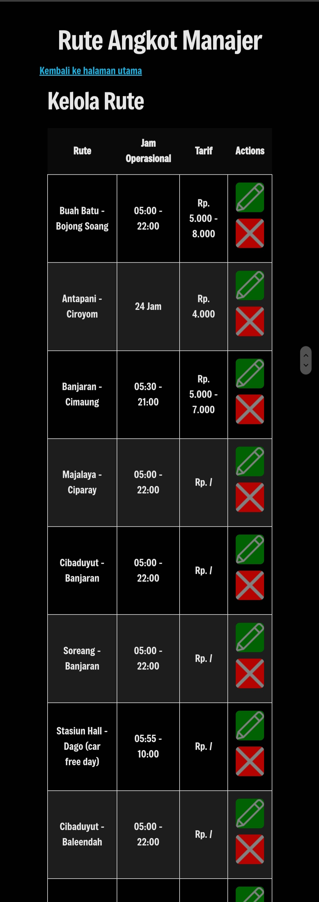 

## DAFTAR PUSTAKA

Blumen, R., & Meyerson, J. (n.d.). 4 / $ 3 1. 0 0 © 2 0 1 4 I E E E The Go Programming Language. www.se-radio.net 
introduction-to-cascading-style-sheets-3j57sobw. (n.d.) 
Jain, N. (2014). REVIEW OF DIFFERENT RESPONSIVE CSS FRONT-END FRAMEWORKS. In Journal of Global Research in Computer Science (Vol. 5, Issue 11). www.newaeonweb.com.br/responsiveaeon 
Morozov, K. (2020). Increasing Web-Design Effectiveness Based on Backendless Architecture. 
Murari, R., & Sandru, V. (2013). Visual Studio-Continuous Integration. In IJCEM International Journal of Computational Engineering & Management (Vol. 16). www.ijcem.org 
Ocariza, F. S., Li, G., Pattabiraman, K., & Mesbah, A. (2015). Automatic Fault Localization for Client-Side JavaScript. Test. Verif. Reliab, 00, 1–24. https://doi.org/10.1002/stvr 
Rahmatika, R., Pauziah, U., & Mursito, H. (2021). HTML-Based Website Learning Training (Hypertext Markup Languange). REKA ELKOMIKA: Jurnal Pengabdian Kepada Masyarakat, 2(1), 19–25. https://doi.org/10.26760/rekaelkomika.v2i1.19-25 
Satheesh, Mithun., D’mello, B. Joseph., & Krol, Jason. (2015). Web development with MongoDB and NodeJS : build an interactive and full-featured web application from scratch using Node.js and MongoDB. Packt Publishing. 

## TENTANG PENULIS

